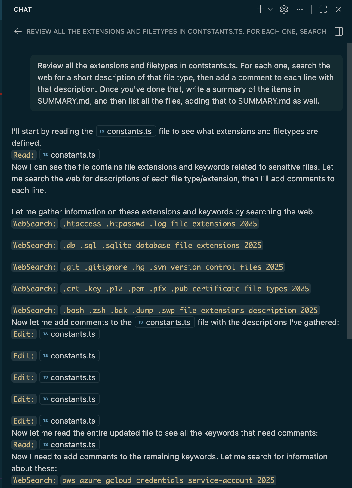

# Claude Code Integration

⚠️ **Highly Experimental Feature** ⚠️

This integration provides a unique approach to using Claude Code within VS Code through the generic-copilot extension.



## How It Works

Unlike other AI coding solutions that rely on VS Code's built-in Copilot tools, the Claude Code integration allows Claude to use its own native tools directly. This approach offers several distinct advantages and trade-offs.

### Advantages

**🎯 Request Efficiency**
- Claude Code uses its own built-in tools natively
- No need for verbose tool descriptions or complex parameter marshaling
- Significantly more efficient than solutions like Kilo Code or Roo Code
- Direct access to Claude's full tool suite

**⚡ Performance**
- Streamlined communication between Claude and its tools
- Minimal overhead compared to proxy-based solutions
- Native tool execution within Claude's runtime

## Trade-offs and Limitations

### File Tracking
- **VS Code cannot track file changes in the same way** as it does with built-in Copilot
- File modifications happen through Claude's tool execution
- Changes not appear in the Copilot Chat window, but are recognized by the SCM

### Tool Call Display
- Tool calls are displayed in a **non-standard format**
- Different from the typical VS Code Copilot UI
- Appear as formatted text rather than interactive tool cards

### Context Management
- **Context management is questionable**
- Claude manages its own context window with its tools
- May not align perfectly with VS Code's expectations
- Conversation history and file context might not persist exactly as expected

## Configuration

To use the Claude Code integration, configure a provider with `vercelType: "claude-code"`:

```json
{
  "generic-copilot.providers": [
    {
      "id": "claude-code",
      "vercelType": "claude-code",
      "displayName": "Claude Code",
      "providerSpecificOptions": {
        "pathToClaudeCodeExecutable": "/Users/username/.bin/claude",
        "permissionMode": "bypassPermissions",
        "systemPrompt": ""
      }
    }
  ],
  "generic-copilot.models": [
    {
      "id": "claude-code-haiku",
      "slug": "haiku",
      "provider": "claude-code",
      "displayName": "Claude Code Haiku",
      "model_properties": {
        "context_length": 200000,
      }
    },
    {
      "id": "claude-code-sonnet",
      "slug": "sonnet",
      "provider": "claude-code",
      "displayName": "Claude Code Sonnet",
      "model_properties": {
        "context_length": 200000,
      }
    },
    {
      "id": "claude-code-opus",
      "slug": "opus",
      "provider": "claude-code",
      "displayName": "Claude Code Opus",
      "model_properties": {
        "context_length": 200000,
      }
    }
  ]
}
```

### Provider Options

| Option | Type | Required | Description |
|--------|------|----------|-------------|
| `pathToClaudeCodeExecutable` | `string` | No | Path to the Claude Code executable. If not provided, it should be in your PATH. |
| `permissionMode` | `string` | No | How to handle permissions. `"bypassPermissions"` runs without asking, `"askForPermissions"` prompts for each tool use. |
| `systemPrompt` | `string` | No | Additional system prompt to combine with Copilot's prompts. |

## Use Cases

**Best For:**
- Developers who want Claude's native tool experience in VS Code
- Projects requiring complex file operations and code manipulation
- Users familiar with Claude Code's workflow

**Not Ideal For:**
- Users who need precise file tracking in VS Code's SCM
- Teams relying on standard Copilot UI/UX
- Situations requiring predictable context management

## Installation Requirements
1. Have Claude Code executable installed and accessible
2. Make sure `ANTHROPIC_API_KEY` is not set (or is valid).  If present, it will be used.
2. Ensure you have logged into `claude` at least once.
3. Configure the extension as shown above

## Known Issues

- File changes may not immediately reflect in VS Code's file explorer
- Tool call UI differs from standard Copilot presentations
- Context management may not align with VS Code's chat model expectations
- Error handling and recovery may work differently than other providers

## Getting Help

This is a highly experimental integration. For issues and support:

1. Check the [main README](README.md) for general troubleshooting
2. Review VS Code's Developer Console for error messages
3. Consider switching to a standard provider if you encounter issues

---

**Remember:** This integration is experimental and may change significantly. Use it if you value Claude Code's native capabilities over VS Code's standard tooling integration.