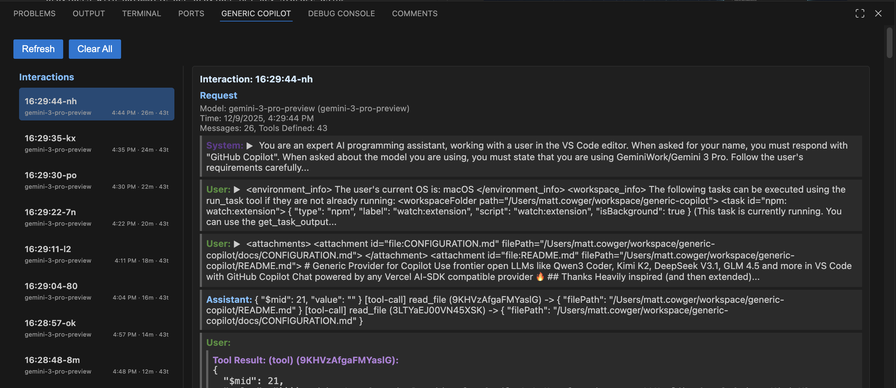

# Console

The Console is a powerful debugging and inspection tool included with Generic Copilot. It allows you to view the raw JSON interactions (requests and responses) between the extension and the configured LLM providers in real-time.

## Overview

The console is divided into two main panels:
1.  **Interaction List (Left)**: A scrollable history of all API calls.
2.  **Interaction Details (Right)**: A detailed view of the selected request and its corresponding response.

## Interaction List

The left panel displays a list of all interactions, ordered with the newest at the top. Each item provides a quick summary:
*   **ID**: The unique identifier (or timestamp) of the interaction.
*   **Model**: The model slug or ID used for the request.
*   **Counts**:
    *   `m`: Number of messages in the context window.
    *   `t`: Number of tools defined for the model.

**Selection**: Clicking on an interaction highlights it in blue (`#1F6AB5`) and loads its details in the right panel.

## Interaction Details

The right panel shows the full content of the selected interaction, split into **Request** and **Response** sections.

### Request
Shows what was sent to the provider:
*   **Metadata**: Model ID, timestamp, message count, and tool count.
*   **Messages**: The full conversation history sent to the model (System, User, Assistant).

### Response
Shows what was received from the provider:
*   **Metadata**: Timestamp, counts for text/thinking parts and tool calls.
*   **Content**: The actual response text, "thinking" blocks (for models that support Chain of Thought), and any tool calls generated by the model.

## Color Coding

To make the logs easier to scan, different roles and message types are color-coded:

*   **User**: Green (`#4e8f3a`)
*   **System**: Purple (`#613a8f`)
*   **Assistant**: Light Blue (`#79C0FF`)
*   **Thinking**: Magenta (`#8f3a7b`) - Used for CoT content.
*   **Response**: Teal (`#3a868f`) - Used for general response metadata.
*   **Tool Call**: Red/Brown (`#8f3a3a`) - Used when the model requests to call a tool.

## Tool Call Results

If a conversation involves tool usage, the console displays both the **Tool Call** (request from the model) and the **Tool Result** (output from the tool).

*   **Tool Call**: Displayed in the Response section when the model generates it.
*   **Tool Result**: Displayed inline within the message history (usually in the next User or Tool-role message) with the label `Tool Result:`.

## Message Expansion

Long messages (over 50 words) are automatically truncated to keep the view clean. You can toggle the full content by clicking the arrow (▶/▼) next to the role label.
